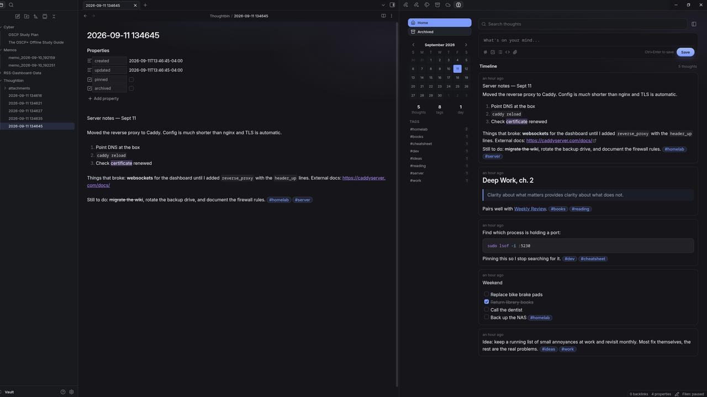

  

# Glow

A dark theme for Obsidian: deep charcoal surfaces, a soft radial light behind your notes, and a periwinkle-to-violet accent. Quiet borders, rounded panels, nothing shouting.

Made to pair with [Thoughtbin](https://github.com/Real-Fruit-Snacks/obsidian-Thoughtbin), but it stands on its own. A matching light mode is included.

## Features

- Dark and light modes built from the same palette
- Accent set through Obsidian's accent variables, so plugins and core UI pick it up automatically
- Gradient note titles, pill tags, accent-tinted blockquotes and callouts, rounded modals and menus
- Subtle glow behind the editor (dark mode only)
- Full syntax colour set for code blocks
- Mobile-aware toolbars and navigation
- Uses Geist and Geist Mono if installed, with clean system fallbacks

## Install

**From the community list** — Settings → Appearance → Themes → Manage → search "Glow".

**Manually**

1. Download `theme.css` and `manifest.json` from the [latest release](https://github.com/Real-Fruit-Snacks/obsidian-glow/releases/latest).
2. Put them in `<your vault>/.obsidian/themes/Glow/`.
3. Settings → Appearance → Themes → Glow.

## Fonts

Glow references [Geist](https://vercel.com/font) for interface and text and Geist Mono for code. They're optional; without them it falls back to Inter / your system font.

## Palette

| Role | Dark | Light |
|---|---|---|
| Background | `#0E0F13` | `#FFFFFF` |
| Surface | `#15171D` | `#F3F4F8` |
| Text | `#F2F3F5` | `#14161C` |
| Muted | `#A2A6AF` | `#5A5F6B` |
| Accent | `#7C9CFF` | `#5B7CFF` |
| Accent 2 | `#B48CFF` | `#7E4FE0` |

## Contributing

Issues and pull requests are welcome. There's no build step — edit `theme.css`, reload Obsidian. Please keep changes to Obsidian's CSS variables where one exists, and test both dark and light modes.

## License

MIT
